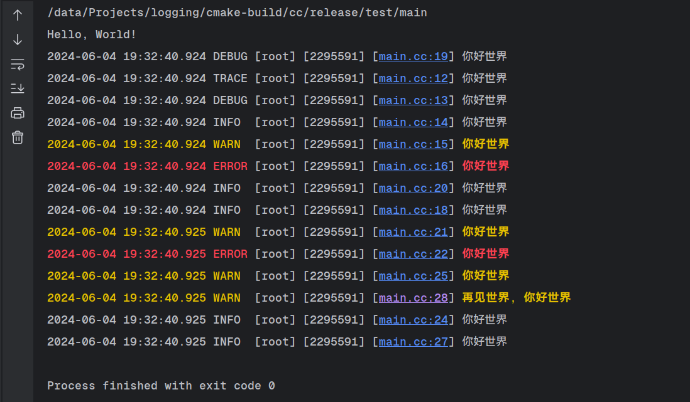

# xlog

一个用起来很简单的日志库（支持滚动文件）

## 控制台

```c++
#include "xlog/api.hh"

#include <iostream>

int main() {
  xlog::Logger<>::getInstance();
  xlog::setLogLevelTo(xlog::Level::TRACE);
  xlog::toggleConsoleLogging(TOGGLE_ON);
  xlog::toggleAsyncLogging(TOGGLE_OFF);
  xlog::InstantiateFileLogger(xlog::Level::TRACE);
  std::cout << "Hello, World!" << std::endl;
  XLOG_TRACE << "你好世界";
  XLOG_DEBUG << "你好世界";
  XLOG_INFO << "你好世界";
  XLOG_WARN << "你好世界";
  XLOG_ERROR << "你好世界";

  MXLOG_TRACE(1) << "你好世界";
  MXLOG_DEBUG(2) << "你好世界";
  MXLOG_INFO(3) << "你好世界";
  MXLOG_WARN(4) << "你好世界";
  MXLOG_ERROR(5) << "你好世界";

  XLOGV(INFO, "%s", "你好世界");
  MXLOGV(WARN, 5, "%s", "你好世界");
#if __has_include(<fmt/format.h>) or __has_include(<format>)
  XLOGFMT(INFO, "{}", "你好世界");
  MXLOGFMT(WARN, 5, "{1}, {0}", "你好世界", "再见世界");
#endif
  // std::this_thread::sleep_for(std::chrono::seconds(1));
  return 0;
}

```



## 文件

```c++
//
// xlog / file.cc 
// Created by brian on 2024-06-04.
//
#include "xlog/api.hh"

#include <iostream>

int main() {
  // 默认只有ID==0的logger写入文件xlog.txt.
  xlog::InstantiateFileLogger(xlog::Level::TRACE, "xlog.txt");
  xlog::toggleConsoleLogging(TOGGLE_ON);
  xlog::toggleAsyncLogging(TOGGLE_OFF);
  XLOG_TRACE << "你好世界"; // ID == 0
  XLOG_DEBUG << "你好世界"; // ID == 0
  XLOG_INFO << "你好世界";  // ID == 0
  XLOG_WARN << "你好世界";  // ID == 0
  XLOG_ERROR << "你好世界"; // ID == 0
  xlog::setLogLevelTo(xlog::Level::INFO);
  std::cout << "Hello, World!" << std::endl;
  MXLOG_TRACE(1) << "你好世界";
  MXLOG_DEBUG(2) << "你好世界";
  MXLOG_INFO(3) << "你好世界";
  MXLOG_WARN(4) << "你好世界";
  MXLOG_ERROR(5) << "你好世界";
  XLOGV(INFO, "%s", "你好世界");
  MXLOGV(WARN, 5, "%s", "你好世界");
#if __has_include(<fmt/format.h>) or __has_include(<format>)
  XLOGFMT(INFO, "{}", "你好世界");
  MXLOGFMT(WARN, 5, "{1}, {0}", "你好世界", "再见世界");
#endif
  // std::this_thread::sleep_for(std::chrono::seconds(1));
  return 0;
}

```

## 详细

请看 [api](include/xlog/api.hh)

## TODO

- 整合yml-cpp
- 配置热加载
- 多线程logger支持
- 支持daily logger
- ...
